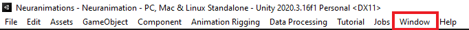
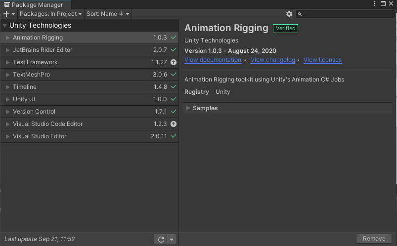
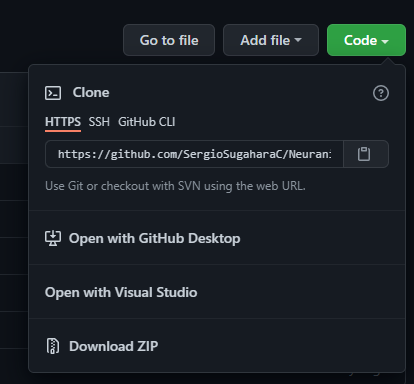
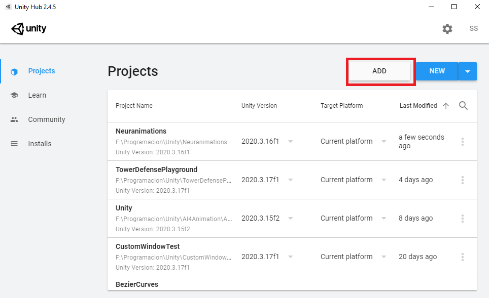

# Installation

## Unity Package Manager

The standard installation uses the Unity Package Manager provided by Unity3D. To open the Package Manager for Unity you have to locate your mouse in the Unity3D Menubar.



Then a Menu will open, reveling the different windows that you can open. Select the option **Package Manager**, you will see the next window.



Then, click the plus

## Cloning Github Repo

You have to have [Git](https://git-scm.com) and [UnityHub](https://unity3d.com/es/get-unity/download) installed in your PC.

To clone out repository use the Command Line to get to the desired installation folder.

```bash
cd C:/DesiredLocation
```
Then, go to the [Neuranimation Repository](https://github.com/SergioSugaharaC/Neuranimations) and the HTTP or SSH from the code button.



Then use the Command Line to clone the repository:

```bash
git clone pasteLink
cd Neuranimations
```

Then, open Unity Hub and click the **Add** button.



Then select the folder where you cloned the repository.