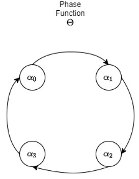

# Phase Functioned Neural Network

The Phase-Function Neural Network[^1] method consist in including a phase value that is responsible for the current stage of the character, while changin the values of the weights and biases of the neural Network. The change of values is determined by a special Phase Function, for Holden et al.[^1]  and for our version, we use Catmull-Rom Spline Function[^2]. In the following sections we will explain the different components of PFNN

## Catmull-Rom Cubic Spline

The Catmull-Rom spline function is used within the model to achieve phases, since this function can obtain a cyclical value in a simple way, having the initial and final points with the same value. The function with only 4 control points was used in this case since they are enough to be able to give a stable and smooth phase.



The input values ​​for this function consist of sets of neural network weights, represented as $\beta = \left\lbrace\alpha_ {0},\alpha_ {1},\alpha_ {2},\alpha_ {3} \right\rbrace$. With this you can define the Catmull-Rom spline function as:

\[
\theta(p;\beta) = \alpha_{k_{1}}\\
+ w(\frac{1}{2}\alpha k_{2} - \frac{1}{2}\alpha_{k_{0}} ) \\
+ w^{2}(\alpha_{k_{0}} - \frac{5}{2}\alpha_{k_{1}}+2 \alpha_{k_{2}} - \frac{1}{2} \alpha_{k_{3}} )\\
+ w^{3}(\frac{3}{2}\alpha_{k_{1}} - \frac{3}{2}\alpha_{k_{2}}+ \frac{1}{2} \alpha_{k_{3}} - \frac{1}{2} \alpha_{k_{0}} )
\]

\[
w=\frac{4p}{2\pi}
\]

\[
k_{n}=[\frac{4p}{2\pi}]+ n-1
\]

This function returns a single set of weights, which will be used for learning this set. This definition was described by Holden, et al.[^1] as the Phase function.

## PFNN Layer

We name a Layer as PFNN when it is presented in $n$ sets of weights and biases, depending on the number of phases that are needed in the project. For this project, 4 phases or control points are used, previously mentioned in the Catmull-Rom function. These sets are created in the same layers as the values ​​of the pesos or $w$, and of the bias or $b$. The weights variable will have the following dimensions $[4, x, y]$, such that $x$ is the dimension of the layer's input data, and $y$ are the layer's units. The bias variable has the dimensions $[4, y]$.

In each call of this layer, the functions defined in the Catmull-Rom section are used to obtain different sets for each input of the Catmull-Rom Spline function and obtain either the weight or the bias for this call.

After this, the weight obtained by the Catmull-Rom function will go through the matrix multiplication function to obtain the weights, and the output goes through the trigger or directly as an output.

The implementation of the NFP layer using Keras is as follows:

```python
class PhaseLayer(layers.Layer):
  def __init__(self, rng=np.random.RandomState(23456),units=512, input_dim=512, number_of_phases=4):
    super(PhaseLayer, self).__init__()
    self.nslices = number_of_phases
    self.units = units
    self.input_dim = input_dim
    self.rng = rng

    self.w = tf.Variable(self.initial_alpha(), name="w", trainable=True)
    self.b = tf.Variable(self.initial_beta(), name="b", trainable=True)

  def initial_alpha(self):
    shape = (self.nslices, self.input_dim, self.units)
    alpha_bound = np.sqrt(6. / np.prod(shape[-2:]))
    alpha = np.asarray(
        self.rng.uniform(low=-alpha_bound, high=alpha_bound, size=shape),
        dtype=np.float32
    )
    return tf.convert_to_tensor(alpha, dtype=tf.float32)
    
  def initial_beta(self):
    return tf.zeros((self.nslices, self.units), dtype=tf.float32)
```

## Model Design

### Activation Function

For the current project, the Exponetial Linear Unity or ELU activator will be used, which is defined as:

\[
f(x)=\left\{ \begin{array}{lcc}
\alpha(e^{x}-1), & x < 0 \\
x, & x \geq 0 
\end{array}
\right.
\]

### Dropout Layer

This layer has the probability (indicated by the developer) of deactivating some neurons of the layer in which it is applied, in order to avoid an over-training of the network, assigning 0 as the weight coefficient to the neurons that are deactivated.

### Model Structure

The built model consists of the following layers in the same order:

* PFNN layer, 311 input data, 512 units.
* ELU activator
* Dropout, with a ratio of 0.3
* PFNN layer, 512 input data, 512 units
* ELU activator
* Dropout, ratio of 0.3
* PFNN layer, 512 input data, 304 units

The input values ​​of the first layer and the units of the last layer can change depending on the amount of activities or inputs that the character has to perform.
The code implemented for the modeling of the function is the following:

```python

class PFNN(tf.keras.Model):
  def __init__(self, input_dim=1, output_dim=1, dropout=0.3, **kwargs):
    super(PFNN ,self).__init__(**kwargs)
    self.nslices = 4
    self.input_dim=input_dim
    self.output_dim=output_dim

    self.dropout0 = layers.Dropout(dropout)
    self.dropout1 = layers.Dropout(dropout)
    self.dropout2 = layers.Dropout(dropout)

    self.activation = layers.ELU()

    self.layer0 = PhaseLayer(input_dim=input_dim)
    self.layer1 = PhaseLayer()
    self.layer2 = PhaseLayer(units=output_dim)

  def call(self, inputs):
    pscale = self.nslices * inputs[:,-1]
    pamount = pscale % 1.0

    pindex_1 = tf.cast(pscale, 'int32') % self.nslices
    pindex_0 = (pindex_1-1) % self.nslices
    pindex_2 = (pindex_1+1) % self.nslices
    pindex_3 = (pindex_1+2) % self.nslices

    bamount = tf.expand_dims(pamount, 1)
    wamount = tf.expand_dims(bamount, 1)

    def cubic(y0, y1, y2, y3, mu):
      return (
       (-0.5*y0+1.5*y1-1.5*y2+0.5*y3)*mu*mu*mu + 
       (y0-2.5*y1+2.0*y2-0.5*y3)*mu*mu + 
       (-0.5*y0+0.5*y2)*mu +
       (y1))
    
    W0 = cubic(
        tf.nn.embedding_lookup(self.layer0.w, pindex_0), 
        tf.nn.embedding_lookup(self.layer0.w, pindex_1), 
        tf.nn.embedding_lookup(self.layer0.w, pindex_2), 
        tf.nn.embedding_lookup(self.layer0.w, pindex_3), 
        wamount)
    W1 = cubic(
        tf.nn.embedding_lookup(self.layer1.w, pindex_0), 
        tf.nn.embedding_lookup(self.layer1.w, pindex_1), 
        tf.nn.embedding_lookup(self.layer1.w, pindex_2), 
        tf.nn.embedding_lookup(self.layer1.w, pindex_3), 
        wamount)
    W2 = cubic(
        tf.nn.embedding_lookup(self.layer2.w, pindex_0), 
        tf.nn.embedding_lookup(self.layer2.w, pindex_1), 
        tf.nn.embedding_lookup(self.layer2.w, pindex_2), 
        tf.nn.embedding_lookup(self.layer2.w, pindex_3), 
        wamount)
    
    b0 = cubic(
        tf.nn.embedding_lookup(self.layer0.b, pindex_0), 
        tf.nn.embedding_lookup(self.layer0.b, pindex_1), 
        tf.nn.embedding_lookup(self.layer0.b, pindex_2), 
        tf.nn.embedding_lookup(self.layer0.b, pindex_3), 
        bamount)
    b1 = cubic(
        tf.nn.embedding_lookup(self.layer1.b, pindex_0),
        tf.nn.embedding_lookup(self.layer1.b, pindex_1),
        tf.nn.embedding_lookup(self.layer1.b, pindex_2),
        tf.nn.embedding_lookup(self.layer1.b, pindex_3),
        bamount)
    b2 = cubic(
        tf.nn.embedding_lookup(self.layer2.b, pindex_0),
        tf.nn.embedding_lookup(self.layer2.b, pindex_1),
        tf.nn.embedding_lookup(self.layer2.b, pindex_2),
        tf.nn.embedding_lookup(self.layer2.b, pindex_3),
        bamount)
    
    H0 = inputs[:, :-1]
    H1 = self.activation(tf.matmul(self.dropout0(H0), W0) + b0)
    H2 = self.activation(tf.matmul(self.dropout0(H1), W1) + b1)
    H3 = tf.matmul(self.dropout2(H2), W2) + b2

    return H3
```

## Original Implementation and Data

In the original blog by Holden contains the origin version of the code for the PFNN Network using Theano. Here you can also find the data used for out work and th weights and biases of the output.

[Original Implementation of Holden](https://theorangeduck.com/page/phase-functioned-neural-networks-character-control)

[^1]: 
  Holden, D., Komura, T., & Saito, J. (2017). Phase-functioned neural networks for character control. ACM Transactions on Graphics (TOG), 36(4), 1-13.
[^2]:
  Twigg, C. (2003). Catmull-rom splines. Computer, 41(6), 4-6.

*[PFNN]: Phase-Funtion Nerual Network