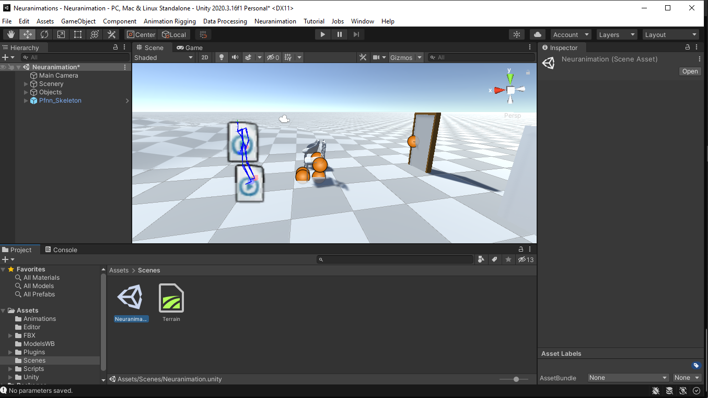
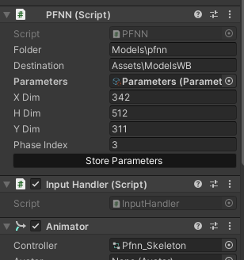

# Using the Package

In the following sections we described the usage of the package. This will include, creating an animation, using the animation and a view on the options and ui components available for the user.

## Neuranimation Menu

The Neuranimation menu is a simple dropdown menu that has different resources to help the user. This Guide will be available in the same Dropdown menu.

### Neuranimation Window - (Information)

The first option availble is the Neuranimation window. In this window we display basic information and some links to out outside resources, like our repository.

### Versions Option - (Versions)

This option will redirect the user to the Git repository.

### Model Option - (Model)

This option will send the user to the model Repository. But if you like to use other PFNN implemetation you can find some in the following pages:

- https://theorangeduck.com/page/phase-functioned-neural-networks-character-control
- https://www.starke-consult.de/portfolio/assets/content/work/8/page.html

### Guide Option - (Guide)

The Final Option presents a Link to this guide.

## Storing Parameters

The package can not be run out of the box. First, you need to load the Neuranimation Scene, this scene can be found in the Scenes folder. After you opened the scene. you can see a a character, some objects and terrain.

Before you start to walk around with the caracter you will have to store the parameters of the Neural Network. We have included a pretrained version of the model and this can be load with the Store Parameter Button, present in the Pffn_Skeleton.

When you press the store Parameter Button you can look in the ModelWB folder a new parameter file. This file will be used by the neural network to create the animations. Now you can press the Play button and start walking.

## Create a animations

To create a new animation or interaction you will have to use the animator an create a new Unity 3D animation. When you have the animation, using the rigs of the character, you can add the interaction to the animation switcher. This is a component we have develop to manage the interactions of characters.